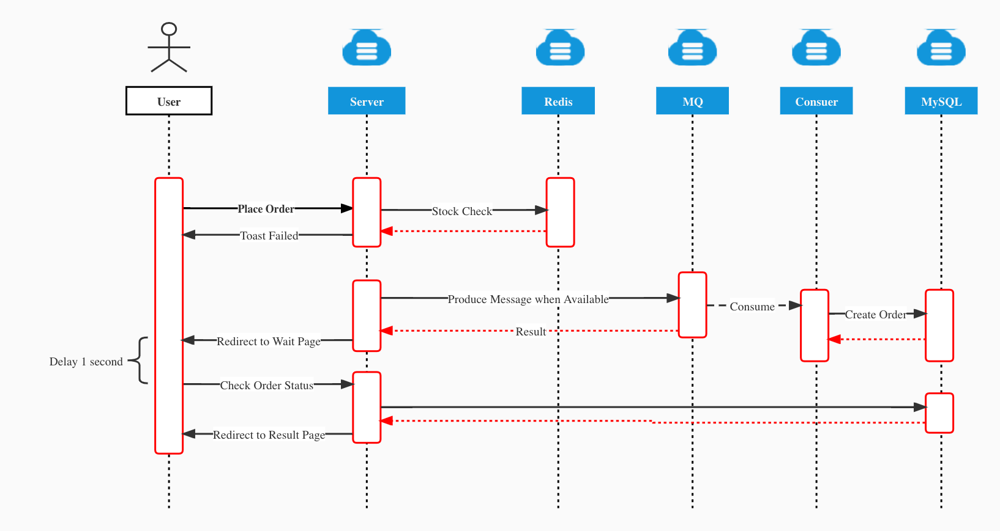
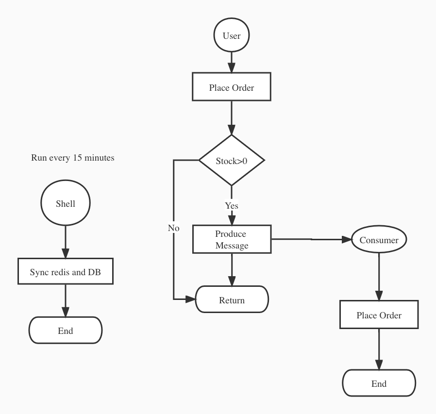
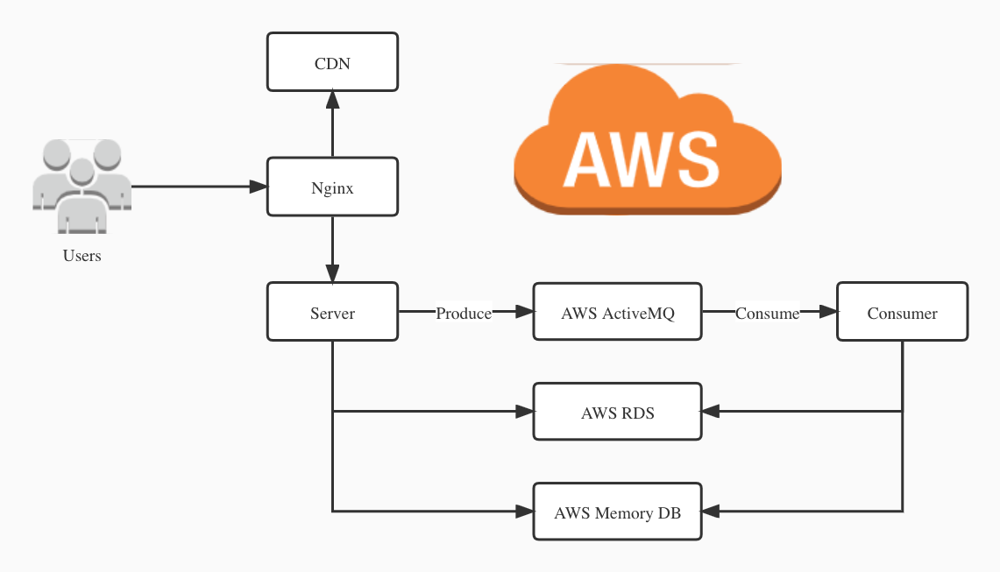
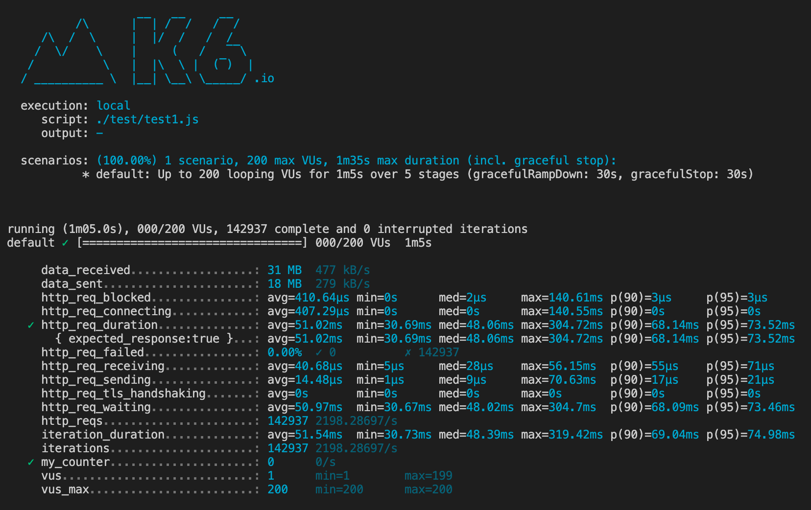
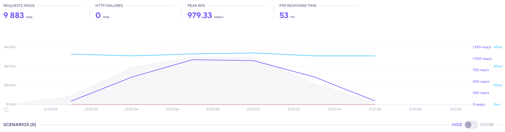
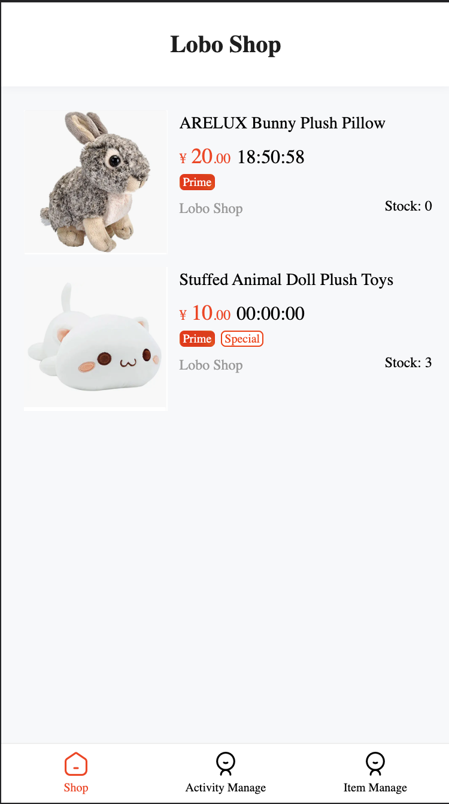
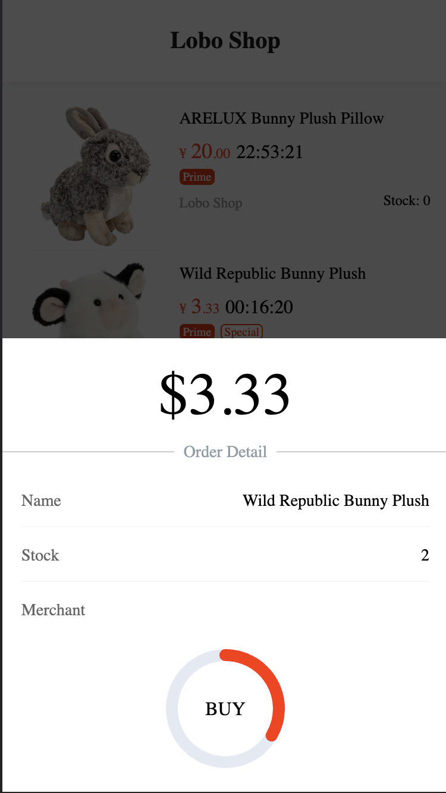
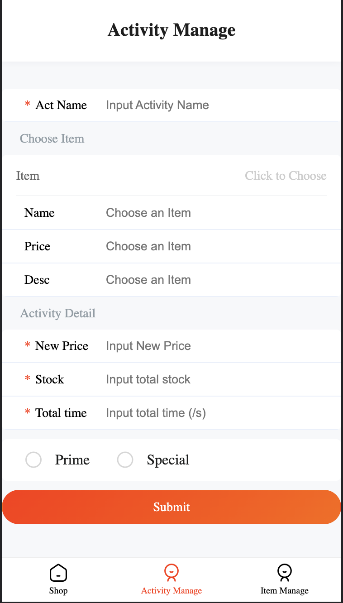

# High Concurrency Online Shopping System
Loboshop is a web service for online flash sale that provides high throughput and availability under huge user flow. It features a great handling capacity with more than 2000 req/s on a single t2.micro instance (1 CPU,1G memory).

## Feature
- Beautiful user interface by **React**
- Exact stock manangement by **Optimistic** **Lock** and **TCC** (Try-confirm-cancel)
- Asynchronously peak-load shifting by **ActiveMQ**
- High concurrency stock check by **Lua** on **Redis**
- Distributed ID generator algorithm **Snowflake**
- Support request throttling and Circuit-breaker
- DB Index Optimization
- Separated front-end and back-end

## code
Front-end: https://github.com/NiconicoGao/flash-sale-frontend \
Back-end: https://github.com/NiconicoGao/flash-sale-backend \
Demo: http://54.201.152.192/shop 

## Process Flow
Sequence Chart

Flow Chart

Specifically, we need a shell to synchronize data between Redis and MySQL because network error may occur causing data inconsistency. 
## Achitecture 

## Load Test
Install K6 by instruction https://k6.io/docs/getting-started/installation/ 
and run
>    k6 run ./test1

You can also use K6 Cloud to get a pretty graph.

However, free user have only 50 VUs maximum. 
## Screen Shot

